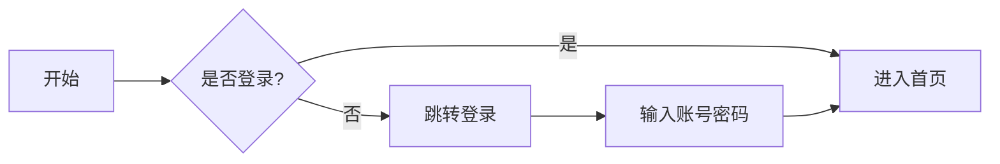

本页用于验证 echarts / mermaid / markmap 图表功能是否正常工作。

## ECharts 图表

```echarts
{
  "title": { "text": "ECharts 示例" },
  "tooltip": {},
  "xAxis": { "data": ["衬衫", "羊毛衫", "雪纺衫", "裤子", "高跟鞋", "袜子"] },
  "yAxis": {},
  "series": [{ "name": "销量", "type": "bar", "data": [5, 20, 36, 10, 10, 20] }]
}
```

## Mermaid 流程图



## Markmap 思维导图

```markmap
# 思维导图

## 前端
### 框架
- Vue
- React
### 样式
- CSS
- SCSS
## 后端
- Node.js
- Python
```
